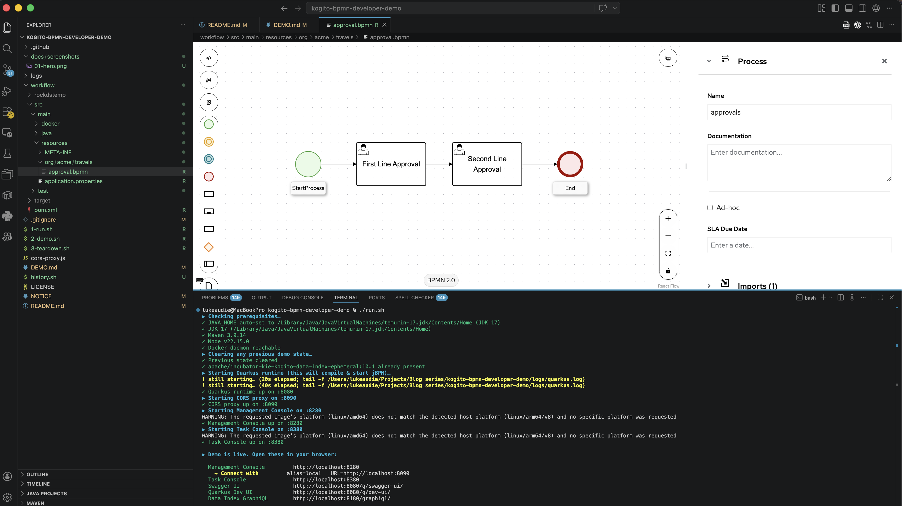

# BPMN on Apache KIE / Kogito — Live Demo Script

A click-by-click walkthrough designed to be delivered live in **~10 minutes** to a
mixed audience (i.e. solution architects, process automation, workflow engineers). Visuals carry the story.

> **Format conventions**
> 🖱  *Click / action you perform*
> 💬 *What you say out loud*
> 👀 *What the audience sees on screen*
> 💡 *Optional aside if you have time / get a question*

---

## Scene 0 — Pre-flight (do this BEFORE the audience joins)

### One command starts everything

```bash
./1-run.sh
```

It checks prereqs, clears any previous state, starts the Quarkus runtime,
CORS proxy, Management Console, Task Console, **BPMN Editor (your local
sandbox.kie.org)**, **a kind Kubernetes cluster wired up for the editor's
Dev Deployments feature**, and auto-opens four browser tabs. Wait for
"Demo is live." and the tabs to appear.

> First run is slow (~3–5 min) because of the kind cluster + ingress
> controller. Subsequent runs reuse the cluster and start in ~90 s.
> Skip the cluster entirely with `./1-run.sh --no-devdeploy` if you only
> need the analyst loop.

### Persistence

Active process instances are stored in an embedded RocksDB at `./data/`
on the host, so they survive Quarkus restarts and even `./3-teardown.sh
&& ./1-run.sh`. Wipe with `./3-teardown.sh --wipe-data`. Note: the Data
Index history (Mgmt Console timeline of *completed* instances) lives in
its own dev-services container and *does* reset on each teardown.

### Key URLs the analyst needs

| Tab | URL |
|---|---|
| **BPMN Editor** (local Sandbox) | **http://localhost:8480** |
| BPMN file to import into the editor | http://localhost:8090/bpmn/approval.bpmn |
| Management Console | http://localhost:8280 |
| Swagger UI | http://localhost:8080/q/swagger-ui/ |

The full list (incl. Task Console, Dev UI, Data Index) is in [Cheat sheet — URLs](#cheat-sheet--urls) at the bottom.

### One-time: connect the Management Console to the runtime

The first time you load http://localhost:8280/ in a fresh browser profile,
you'll see a **"Welcome to Apache KIE™ Management Console"** screen with a
**+ Connect to a runtime…** button. The console stores connections in
browser localStorage, so you only do this **once per browser profile**.

🖱  Click **+ Connect to a runtime…**

In the dialog:
- **Alias:** `local`
- **URL:** `http://localhost:8090`
- Leave **Force login prompt** unchecked (the local runtime is unsecured —
  the proxy answers the auth probes for it).
- Ignore **Advanced OpenID Connect settings**.

🖱  Click **Connect**.

You should land on the Process Instances page. The connection persists —
on the next `./1-run.sh`, you'll skip straight to it.

> If you ever need to reconnect (e.g. you cleared cookies), come back to
> http://localhost:8280/ and the same dialog appears.

### Browser tabs (auto-opened by `1-run.sh`)

1. **http://localhost:8480/** — BPMN Editor (your local copy of sandbox.kie.org). **Home base for the analyst.**
2. **http://localhost:8280/** — KIE Management Console (live process state — the headline runtime visual)
3. **http://localhost:8080/q/swagger-ui/** — auto-generated REST surface
4. **http://localhost:8080/q/dev-ui/** — Quarkus Dev UI (extensions, dev tools)

The Task Console at **http://localhost:8380/** is also running but not
auto-opened — the Management Console covers tasks too. Open the Task
Console manually if you want to demo the end-user inbox UI separately.

> No IDE required for this demo. The BPMN Editor at :8480 is the same
> visual modeller that powers sandbox.kie.org, served entirely from your
> laptop.

### Heads-up: skip the Sandbox's "Log In" prompts

On first load the BPMN Editor may offer to **Connect to GitHub /
Bitbucket** or **Connect to OpenShift / Kubernetes**. Those are *optional*
integrations for importing from a Git repo or deploying to a cluster —
**this demo uses neither**. Dismiss / close the prompt; the editor itself
needs no login. The analyst flow is purely: Import from URL → edit →
Download → `./4-import.sh`.

### Sanity checks
```bash
curl -s localhost:8080/approvals                           # → []
curl -s localhost:8090/approvals -o /dev/null -w "%{http_code}\n"   # → 200 (via proxy)
curl -sI localhost:8280 | head -1                           # → 200 OK
```

> Cold-start build can be slow (~30-90s on first run, longer if pulling
> images). The consoles are amd64-only and run under Rosetta on M-series
> Macs — give them ~30s after the container starts before they're truly
> usable.

---

## Scene 1 — "A simple Claims process?" (the BPMN model in your local Sandbox)

💬  *"Picture a typical claims approval: a customer submits a claim, a
front-line analyst gives it a first look, and then a senior analyst signs it
off. To prevent fraud, the two approvers must be different people. That's the
process we're going to model — four steps end-to-end:*

1. *A claim arrives (kicks the process off — no human needed).*
2. ***First-line approval*** *— a manager reviews the claim and decides.*
3. ***Second-line approval*** *— a different manager double-checks and signs off.*
4. *The claim is closed (paid out, rejected, or routed onward).*

*That's a real compliance pattern called the **four-eye principle** — and we'll
see in a moment that the engine enforces 'different people' for us, no
application code required."*

🖱  Switch to the **BPMN Editor** tab (http://localhost:8480/).

💬  *"This is sandbox.kie.org — but running entirely on my laptop. Same
visual modeller a business analyst uses in the browser, no install, no
account. I'm going to import our claims process from the running project."*

🖱  On the editor home, click **Import** (or use the import card). Paste the URL printed by `1-run.sh`:

```
http://localhost:8090/bpmn/approval.bpmn
```

🖱  Click **Import**. The graphical editor renders the diagram.



👀 Audience sees a left-to-right flow that maps onto exactly those four steps:
*Start ▶ "First Line Approval" (user task) ▶ "Second Line Approval" (user task) ▶ End*

💬  *"BPMN — Business Process Model and Notation — is a visual standard for
modelling business processes. Every shape has a precise meaning. The circle on
the left is a **start event** — that's step 1. The rounded rectangles with the
little person icon are **user tasks** — steps that need a human, our two
approvals. The circle on the right is the **end event**. The arrows are
sequence flow — they say what runs next. That's almost the whole vocabulary
you need to read this diagram."*

🖱  Click **First Line Approval**. Properties panel opens.

👀 Properties show: name, assignment (group: `managers`), input/output mappings.

💬  *"Notice this is just a graphical representation — under the hood it's
XML. But you and a business analyst can read this together, and what you see
is what runs in production. There's no separate 'business view' and
'engineering view' — same file, same tool."*

💡 *(if asked)* The file is `.bpmn` — pure BPMN 2.0 standard. The flow itself
is portable; the data-mapping and assignment annotations used here are
Kogito/jBPM extensions, so a perfect 1:1 swap to Camunda or Flowable would
need their equivalent extensions wired in.

---

## Scene 2 — "How does Kogito turn a diagram into a service?"

🖱  Switch to **Terminal A** (Quarkus running). Scroll up to the build banner.

👀 Audience sees Quarkus startup log — fast (~3s) boot.

💬  *"Kogito takes that BPMN file at build time and code-generates a working
REST API. We didn't write a single REST controller. Let me show you."*

🖱  Open **http://localhost:8080/q/swagger-ui/** in the browser.

👀 Audience sees endpoints: `POST /approvals`, `GET /approvals`,
`/approvals/{id}/firstLineApproval/{tid}`, `/approvals/{id}/secondLineApproval/{tid}`.

💬  *"Every endpoint here was generated from the BPMN. The user-task
endpoints are named after the tasks in the diagram. If I rename a task in VS
Code and save, this URL changes too — the diagram IS the API."*

💡 *(if asked)* It's not interpreted at runtime — Kogito compiles the BPMN
to Java at build time. Hence the fast startup and native-image friendliness.

---

## Scene 3 — "Drive the first half of the process"

🖱  Open **http://localhost:8280/** (KIE Management Console).

👀 Audience sees the console UI, navigation: Process Instances, Jobs, Tasks.

🖱  In a terminal: `./2-demo.sh` and press Enter twice to advance to step 2 (POST /approvals).

👀 The script POSTs an approval payload (a `traveller`) and prints the new instance UUID.

💬  *"That UUID is now a real running BPMN process inside the JVM. Right
now it's parked on the first-line approval, waiting for a human."*

🖱  Switch to the Management Console → click **Process Instances** in the side nav.

👀 A row appears with state `Active`.

🖱  Click the row.

👀 Detail page loads. Breadcrumb reads
`local (Unknown user @ http://localhost:8090) > Process Instances > {uuid}`.
Three panels are visible:
- **Details** — Name `approvals`, State `Active`, the instance Id, and an
  **Endpoint** of `http://localhost:8090` (that's the CORS proxy the console
  talks to — same URL we wired up in Scene 0).
- **Variables** — the exact `traveller` JSON we just POSTed, live from the
  engine.
- **Timeline** — `StartProcess` ✓ a few seconds ago, then **First Line
  Approval — Active** with a person icon.

💬  *"Live state. The engine is telling us exactly where in the process this
instance is — parked on First Line Approval, waiting for a human, and the
variables it's carrying are right there. Imagine a customer-facing dashboard
rendering this same timeline — 'your loan application is at the credit check
stage'. That's what this is giving you for free."*

---

## Scene 4 — "Approve as a manager (impersonation)"

🖱  In the Management Console side nav, click **Tasks**.

👀 Empty list — "Anonymous" doesn't see anything.

💬  *"By default I'm logged in as Anonymous, who isn't in the managers
group. Real production would use OIDC for auth. For demo purposes the
console has an Impersonate feature."*

🖱  Expand the **Impersonating** panel at the top of the Tasks page (the
collapsible card labelled "Impersonating 'Anonymous'" — click the chevron).

🖱  Fill in:
- **User:** `manager`
- **Groups:** `managers`  *(helper text: "Comma-separated list, no spaces.")*
- Click **Apply**.

👀 Panel collapses; the header now reads `Impersonating 'manager'`. The
**First Line Approval** task appears in the list with a **Reserved** badge
next to its name.

🖱  Click the task → form panel renders showing the Traveller fields
(Address > City "Boston", Country "US", Nationality "American", etc.).

🖱  **Tick the `Approved` checkbox**, then click **Complete**.
*(Buttons available: **Complete / Release / Skip**.)*

💬  *"That checkbox isn't hand-coded UI — it's auto-generated from the BPMN
task's `approved: Boolean` data output. Whatever the manager ticks here
flows back into the process variables. Watch."*

👀 Task disappears from the inbox. Back to **Process Instances** → click the
row → **Variables** now contains an extra `approved: true`, and the
**Timeline** shows First Line Approval ✓ and **Second Line Approval —
Active**.

💬  *"First approval done — and the engine recorded who approved it. Now the
four-eye part: I'll try to approve the second step as the same person…"*

---

## Scene 5 — "The four-eye principle in action"

🖱  Stay on the **Tasks** tab, still impersonating `manager`.

👀 The inbox is **empty**. The Second Line Approval task is *not visible* to
this user.

💬  *"That's the four-eye principle — at the model level. The BPMN wires the
second task's `ExcludedOwnerId` to whoever completed the first task, so the
engine quietly removes that user from the second task's candidate list.
Nothing for me to enforce in application code; the rule is in the diagram."*

💡 *(if asked)* See `approval.bpmn` — the Second Line Approval task has an
`ExcludedOwnerId` input mapped from the first task's `ActorId` output. Pure
BPMN; portable.

🖱  Re-open the **Impersonating** panel and switch:
- **User:** `mary`
- **Groups:** `managers`
- Click **Apply**.

👀 Inbox now shows **Second Line Approval — Reserved**.

🖱  Click it → tick **Approved** → **Complete**.

👀 **Process Instances** with the default (Active) filter: the row is gone.
Switch the filter to **Completed** → click the row → the **Timeline** shows
StartProcess ✓, First Line Approval ✓, Second Line Approval ✓, EndProcess ✓.

💬  *"Full lifecycle. Started by a REST call, advanced by two different
humans, completed cleanly. The compliance rule was enforced by the model —
no application code needed."*

---

## Scene 6 — "What changes when an analyst edits the model?"

🖱  Switch back to the **BPMN Editor** tab (http://localhost:8480/) — the
diagram you imported in Scene 1 is still there.

🖱  Click the **First Line Approval** task → in the properties panel on the
right, rename it to "**Compliance Check**".

🖱  In the editor toolbar, click **Download** (or the kebab menu →
Download). The file lands in your `~/Downloads` folder as `approval.bpmn`.

🖱  In a terminal, run:

```bash
./4-import.sh
```

That copies the freshly downloaded file over
`workflow/src/main/resources/org/acme/travels/approval.bpmn`. Quarkus dev
mode picks the change up on the next request — no restart.

🖱  POST another `/approvals` via Swagger UI (or run `./2-demo.sh`).

🖱  Switch to Management Console → Process Instances → click the new row.

👀 The **Timeline** lists the renamed step (`Compliance Check — Active`)
instead of `First Line Approval`, and the Tasks inbox shows the new name
too. **No restart.** Hot reload.

💬  *"That's the analyst loop, end-to-end in a browser: open the model,
rename a task, download, import, see it live. The diagram really is the
source of truth — both for the people who design the process and for the
service that runs it."*

---

## Bonus scene — "Deploy this to a real cluster from the editor" (Dev Deployments)

> Skip if you ran with `./1-run.sh --no-devdeploy`.

🖱  Switch to the **BPMN Editor** tab (http://localhost:8480/).

🖱  In the top toolbar, click **Dev Deployments ▾** → **Connect to an account…**

🖱  Choose **Kubernetes** in the provider list.

When the wizard opens, ignore the multi-step "Configure a new local
Kubernetes cluster" instructions — `./1-run.sh` already did all of that
for you. Skip to **step 2 — Set connection info**, paste the three
values printed at the end of the run (also saved to
`logs/devdeploy-wizard.txt`):

- **Namespace:** `local-kie-sandbox-dev-deployments`
- **Kubernetes API URL:** `http://localhost/kube-apiserver`
- **Token:** *(printed by `./1-run.sh`; full value in
  `logs/devdeploy-wizard.txt`)*

🖱  Click **Connect**. The editor confirms the connection.

🖱  With `approval.bpmn` open in the editor, click **Dev Deployments ▾**
→ **Deploy**. The editor packages the BPMN into a Quarkus image,
applies a Deployment + Service + Ingress to the kind cluster, and
returns a URL.

👀 In a few minutes a live Quarkus pod runs the same BPMN we've been
editing — but inside Kubernetes, not on your laptop directly.

### Verifying the deployment

The fastest signal is in the editor: the **Dev Deployments ▾** panel
shows a status badge per deployment.

- 🟡 **In progress** — image building / pod scheduling (~30–60 s)
- 🟢 **Ready** — pod is `Running` and ingress URL responds. The entry becomes a clickable link to the deployed app's Swagger UI.
- 🔴 **Error** — click the entry for the message.

If you want ground truth from `kubectl`:

```bash
# Pods and ingress in the deployments namespace
kubectl --context kind-kie-sandbox-dev-cluster \
  -n local-kie-sandbox-dev-deployments get deploy,svc,ingress,pods

# Pod logs (replace <pod>)
kubectl --context kind-kie-sandbox-dev-cluster \
  -n local-kie-sandbox-dev-deployments logs <pod> --tail=50
```

A successful deploy shows `READY 1/1`, `STATUS Running`, and an Ingress
with a `HOSTS` value.

To prove the *deployed BPMN itself* answers REST calls (same shape as
Scene 3, just inside the cluster):

```bash
HOST=$(kubectl --context kind-kie-sandbox-dev-cluster \
  -n local-kie-sandbox-dev-deployments \
  get ingress -o jsonpath='{.items[0].spec.rules[0].host}')

curl -sH "Host: $HOST" http://localhost/q/health/ready              # → {"status":"UP",…}
curl -sH "Host: $HOST" -H 'Content-Type: application/json' \
  -d '{"traveller":{"firstName":"Dev","lastName":"Deploy","email":"x","nationality":"x","address":{"street":"x","city":"x","zipCode":"x","country":"x"}}}' \
  http://localhost/approvals
```

A JSON response with an `id` field on the second call means the
deployed BPMN is live — same proof your local Quarkus on `:8080` gives
you, just running inside Kubernetes.

| Symptom | Likely cause |
|---|---|
| Stays 🟡 for >2 min | Quarkus base image pull on first deploy (~250 MB) — keep waiting. |
| 🔴 "ImagePullBackOff" | `kubectl describe pod <pod>` shows the registry it tried. |
| 🟢 but `curl` returns 502 | Ingress controller hasn't reloaded — wait 5 s and retry. |
| Pod `CrashLoopBackOff` | BPMN has a build error; Kogito codegen failure shows in pod logs. |

💬  *"That's the same artefact — same `approval.bpmn` we've been
editing — going from analyst-laptop to a Kubernetes cluster with no
build step on my side. The editor packaged it; the cluster runs it.
For a real environment swap kind for OpenShift and the flow is
identical."*

💡 *(if asked)* This is what the "OpenShift" provider in the same
wizard targets, with an OAuth flow instead of a paste-token. Same
mechanism.

---

## Scene 7 — "What about production?"

💬  *"Four things I'm not showing today, but they're part of this stack:"*

1. **Persistence** — RocksDB for embedded, Postgres for shared/clustered. Plug-and-play.
2. **Eventing** — Process events to Kafka, so other services can subscribe.
3. **Native compilation** — `mvn package -Pnative` produces a ~50 MB
   stand-alone binary that boots in ~50 ms. Great for serverless.
4. **Kubernetes / OpenShift** — Quarkus produces a standard OCI image, so the
   workflow is just another container in your cluster. The
   [**Kogito Operator**](https://docs.kogito.kie.org/latest/html_single/#chap-kogito-deploying-on-openshift)
   on OpenShift takes that further: define a `KogitoRuntime` custom resource
   pointing at your image, and the operator wires up the deployment, service,
   route, persistence, and Kafka connections for you. The Management and Task
   Consoles ship as their own operator-managed resources too. Same model on
   vanilla Kubernetes via Helm charts; OpenShift adds developer-console
   integration and S2I builds from a Git repo.

💬  *"And the auth piece — in production the Impersonate dropdown is
replaced by Keycloak / Okta / Azure AD. The user identity flows through to
the engine and the four-eye principle becomes a real audit trail."*

---

## Scene 8 — Q & A anchor points

| Question | Where to take it |
|---|---|
| "Can a non-developer edit this?" | Already shown in Scene 6 — the BPMN Editor on :8480 *is* sandbox.kie.org running locally. No IDE involved. |
| "How does this differ from jBPM?" | Kogito IS the cloud-native evolution of jBPM. Same engine, packaged for Quarkus / Spring / native. |
| "Decision rules?" | Same toolchain edits DMN files (Decision Model and Notation) alongside BPMN. |
| "OpenShift?" | Kogito Operator + standard Quarkus container build. |
| "Does it scale?" | Stateless workers + external state store; events through Kafka. SonataFlow is the serverless variant. |
| "Why not Camunda?" | Honest answer: similar capabilities; Kogito is tighter Quarkus integration & native image; Camunda has a larger commercial ecosystem. Both are good. |

---

## Cleanup

🖱  Stop everything (workflow, proxy, consoles, editor, kind cluster) and reclaim the Docker images we pulled:
```bash
./3-teardown.sh
```
By default this leaves `kind` / `kubectl` installed and preserves
`./data/` (the RocksDB persistence). Variants:

| Flag | Adds to default |
|---|---|
| `--keep-images` | Leave Docker images on disk (faster next start) |
| `--keep-kind`   | Leave the kind cluster running |
| `--wipe-data`   | Also delete `./data` (forget all process history) |
| `--full`        | Wipe `./data` AND uninstall `kind` + `kubectl` (best-effort, brew on macOS) |

🖱  Revert the BPMN edit if you want a clean repo:
```bash
git checkout -- workflow/src/main/resources/org/acme/travels/approval.bpmn
```

---

## Cheat sheet — URLs

| Purpose | URL |
|---|---|
| BPMN Editor (local sandbox.kie.org) | http://localhost:8480 |
| BPMN file the editor imports | http://localhost:8090/bpmn/approval.bpmn |
| KIE Management Console | http://localhost:8280 |
| Task Console (optional) | http://localhost:8380 |
| Quarkus Swagger UI | http://localhost:8080/q/swagger-ui/ |
| Quarkus Dev UI | http://localhost:8080/q/dev-ui/ |
| Data Index GraphiQL | http://localhost:8180/graphiql/ |
| CORS proxy (what you give the consoles) | http://localhost:8090 |

## Cheat sheet — fallback curl one-liners

```bash
# Start an approval
curl -s -X POST -H 'Content-Type: application/json' \
  -d '{"traveller":{"firstName":"John","lastName":"Doe","email":"jon.doe@example.com","nationality":"American","address":{"street":"main","city":"Boston","zipCode":"10005","country":"US"}}}' \
  http://localhost:8080/approvals | jq .

# List active
curl -s http://localhost:8080/approvals | jq .

# Inspect tasks via data-index (no user filter)
curl -s -X POST -H 'Content-Type: application/json' \
  -d '{"query":"{ UserTaskInstances { id name actualOwner state processId } }"}' \
  http://localhost:8090/graphql | jq .
```

## Architecture (what's actually running)

```
┌──────────────────────────────────────────────────────────────────────┐
│                          Browser tabs                                │
│  ┌──────────────┐ ┌────────────┐ ┌───────────┐ ┌────────────┐        │
│  │ BPMN Editor  │ │ Mgmt :8280 │ │ Task:8380 │ │ Swagger    │        │
│  │ (Sandbox)    │ └─────┬──────┘ └─────┬─────┘ └──────┬─────┘        │
│  │   :8480      │       │              │              │              │
│  └──────┬───────┘       │              │              │              │
└─────────┼───────────────┼──────────────┼──────────────┼──────────────┘
          │ imports BPMN  │              │              │
          ▼               ▼              ▼              ▼
   ┌────────────────────────────────────────┐   ┌───────────┐
   │ CORS proxy :8090                       │   │ Direct to │
   │   /bpmn/*  → workflow/.../approval.bpmn│   │  :8080    │
   │   /graphql → :8180                     │   └─────┬─────┘
   │   *        → :8080                     │         │
   └──┬───────────────────┬─────────────────┘         │
      │                   │                           │
      ▼                   ▼                           ▼
 ┌──────────────┐    ┌────────────────────────┐
 │ Data Index   │    │ Quarkus runtime :8080  │
 │  :8180       │◀───│  (Kogito + jBPM)       │
 │  (GraphQL)   │    │  - approval.bpmn       │
 └──────────────┘    │  - REST + add-ons      │
                     └────────────────────────┘
```
