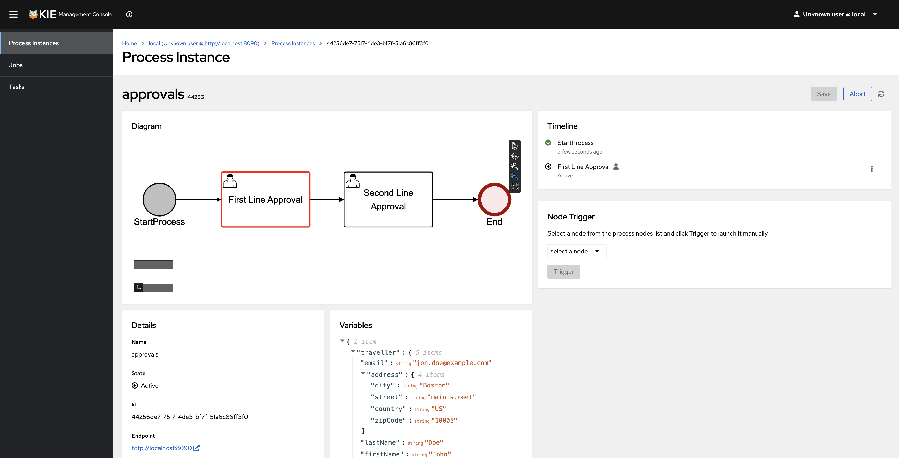

# Kogito BPMN for Analysts — a 10-minute live demo

> **The pitch:** open http://localhost:8480 — that's a local copy of
> [sandbox.kie.org](https://sandbox.kie.org) running on your laptop, the
> visual BPMN editor where you create and edit processes. Run one
> command and you also get a local Kubernetes cluster (kind) ready to
> receive the editor's **Dev Deployments**: click Deploy and your BPMN
> becomes a real Quarkus REST service running in K8s, observable in the
> Management Console with a live diagram + active-step highlight. No
> IDE, no glue code, no separate build step.



[Apache KIE](https://kie.apache.org/) (incubating) is the open-source
process- and decision-automation project behind this demo. Originally
developed at Red Hat as Drools and jBPM, it has powered business-rule
and workflow engines in production for two decades and now underpins
commercial platforms such as Red Hat Process Automation Manager. It
stands out among long-running workflow engines for its speed and
cloud-native, container-first architecture.

## What you'll see

- A real **BPMN 2.0 diagram** authored in your browser (a local **KIE
  Sandbox**, the same UI as sandbox.kie.org) becomes an executable
  Quarkus service running in **a real Kubernetes cluster** — no
  separate build step on your machine.
- The deployed Quarkus runtime code-generates a **REST API** around the
  diagram at deploy time. Endpoints are named after BPMN tasks; rename a
  step in the editor and the URL changes too.
- A **Management Console** shows live process instances with the
  diagram lighting up the active step in red.
- Analysts edit, redeploy, and watch the new version run side-by-side
  with the previous one — no IDE, no Maven, no engineer involved.

## Why it matters (for a non-technical audience)

Most "low-code" workflow tools force you to choose between a polished
business view and a real engineering toolchain. With the KIE / Kogito
stack, the BPMN diagram **is** the source of truth for both — the same
file the business analyst edits is what the engine compiles to a real
Quarkus container in production. Every step in the diagram becomes an
inspectable, observable, auditable event in a real system.

## How to run

### Prerequisites

| Tool | Version | macOS | Linux (Debian / Ubuntu) | Windows |
|---|---|---|---|---|
| Docker Desktop | 24+ | `brew install --cask docker` | `sudo apt install docker.io docker-compose-plugin` | [Docker Desktop installer](https://www.docker.com/products/docker-desktop/) |
| Node | 18+ | `brew install node` | `sudo apt install nodejs npm` | `winget install OpenJS.NodeJS.LTS` |
| kind | 0.20+ | `brew install kind` | [kind quick start](https://kind.sigs.k8s.io/docs/user/quick-start/) | `winget install Kubernetes.kind` |
| kubectl | 1.28+ | `brew install kubectl` | `sudo apt install kubectl` (after [adding the k8s apt repo](https://kubernetes.io/docs/tasks/tools/install-kubectl-linux/)) | `winget install Kubernetes.kubectl` |

That's it — no JDK, no Maven, no IDE. The Quarkus build happens
**inside the kind cluster**, in a pod the Sandbox spins up at deploy
time. You can skip kind+kubectl and the cluster setup with
`./1-run.sh --no-devdeploy`, but then there's nowhere to deploy to.

### Setup — one command

```bash
git clone https://github.com/ch-lukas/kogito-bpmn-developer-demo.git
cd kogito-bpmn-developer-demo
./1-run.sh
```

`1-run.sh` will:
1. Verify prerequisites.
2. Pull the BPMN Editor and Management Console images.
3. Build and load a **patched dev-deploy image** into kind that adds the
   `kogito-addons-quarkus-process-svg` add-on (so the Mgmt Console can
   render the live diagram for any deployed BPMN).
4. Start the BPMN Editor (:8480) and Management Console (:8281).
5. Create a **kind** Kubernetes cluster, install nginx ingress, apply
   the Sandbox's K8s API proxy + RBAC, and print the wizard values for
   **Dev Deployments**.
6. Print the URLs and the wizard values to paste into the editor's
   "Connect to Kubernetes" wizard.

#### Running on each OS

| OS | How to invoke | Extra setup |
|---|---|---|
| **macOS** | `./1-run.sh` from a Terminal tab | None |
| **Linux** | `./1-run.sh` from your shell | `sudo apt install lsof procps` if missing |
| **Windows (WSL2)** | Open a WSL2 distro, `cd` into the cloned repo, run `./1-run.sh` | Install Docker Desktop on Windows + enable WSL2 integration. Inside WSL2: `sudo apt install lsof procps` if missing |
| **Windows (PowerShell / cmd)** | **Not supported** — use WSL2 | bash + lsof + pgrep are required |

If `./1-run.sh` reports `permission denied`:
`chmod +x 1-run.sh 3-teardown.sh 2-exec.sh`.

You'll see something like this at the end:

```
Demo is live. Open these in your browser:

  BPMN Editor (Sandbox)  http://localhost:8480
    → Open file from URL  http://localhost:8090/bpmn/approval.bpmn
  Management Console     http://localhost:8281
    → After deploy run    ./2-exec.sh console  # prints alias + URL to paste

▶ Dev Deployments — paste these into the editor's wizard:
  Namespace             local-kie-sandbox-dev-deployments
  Kubernetes API URL    http://localhost/kube-apiserver
  Token                 eyJhbGciOi…  (full token: logs/devdeploy-wizard.txt)
  Editor route:        http://localhost:8480 → Dev Deployments ▾ → Connect to an account…
```

### Cleanup

```bash
./3-teardown.sh             # stop containers + cors-proxy; preserve cluster + images
./3-teardown.sh --wipe-data # also delete ./data
./3-teardown.sh --full      # nuke kind cluster, prune demo images, wipe data, brew-uninstall kind/kubectl
```

Default is gentle on purpose so the next `./1-run.sh` starts in ~30 s
and other Kogito work on the same machine isn't disturbed.

## Walkthrough

For the click-by-click presenter script — designed to be delivered
live in ~10 minutes — see [DEMO.md](./DEMO.md). Eight scenes from
"open the editor" through "deploy to Kubernetes from the browser" to
"edit, redeploy, see two versions side by side".

Most useful single command after setup:

```bash
./2-exec.sh                 # prints all subcommands
./2-exec.sh swagger         # opens the deployed Quarkus's Swagger UI
./2-exec.sh console         # prints the URL to paste into the Mgmt Console
./2-exec.sh start hiring '{"candidate":"Alice","experience":7,"skills":"Java"}'
```

## Architecture

```
┌──────────────────────────────────────────────────────────────┐
│                       Browser tabs                           │
│  ┌──────────────┐  ┌─────────────────┐                       │
│  │ BPMN Editor  │  │   Management    │                       │
│  │ (Sandbox)    │  │   Console       │                       │
│  │   :8480      │  │   :8281         │                       │
│  └──────┬───────┘  └────────┬────────┘                       │
└─────────┼───────────────────┼────────────────────────────────┘
          │                   │
          ▼                   ▼
   ┌────────────────────────────────────────────────────────┐
   │ CORS proxy :8090                                        │
   │   /bpmn/<file>      → samples/<file>                    │
   │   /viewer/<id>/<p>  → in-proxy KIE read-only editor     │
   │   /cluster/<id>/*   → kind ingress :80                  │
   └─────────────────────────┬───────────────────────────────┘
                             │
                             ▼
   ┌────────────────────────────────────────────────────────┐
   │ kind cluster (kie-sandbox-dev-cluster)                  │
   │ ┌────────────────────────────────────────────────────┐  │
   │ │ ingress-nginx :80                                   │  │
   │ │   /dev-deployment-<id>/* → Service → Quarkus pod    │  │
   │ │ ┌────────────────────────────────────────────────┐  │  │
   │ │ │ Quarkus pod  (built from BPMN at deploy time)   │  │  │
   │ │ │   - kogito-addons-quarkus-process-svg ✦         │  │  │
   │ │ │   - process-management, data-index-jpa, jobs    │  │  │
   │ │ │   - REST API auto-generated from BPMN           │  │  │
   │ │ └────────────────────────────────────────────────┘  │  │
   │ │   ✦ added on top of the upstream Sandbox base image │  │
   │ │     by images/dev-deployment-quarkus-blank-app-svg/ │  │
   │ └────────────────────────────────────────────────────┘  │
   └────────────────────────────────────────────────────────┘
```

### Why the CORS proxy?

The Management Console is built for OIDC-secured production workflows.
Pointing it at the kind cluster's nginx ingress directly trips on
duplicate CORS headers + same-origin restrictions. The proxy
([cors-proxy.js](./cors-proxy.js)) is a zero-dependency Node script
that:

- Rewrites `/cluster/<deployId>/<rest>` to
  `/dev-deployment-<deployId>/<rest>` on the kind ingress, with
  consistent CORS headers — that's how the Mgmt Console reaches the
  deployed Quarkus.
- Serves the starter BPMN at `/bpmn/<file>.bpmn` from `samples/` so the
  editor can import via URL.
- Hosts a tiny in-proxy read-only KIE editor at `/viewer/<id>/<p>` for
  quick "what does this deployed BPMN look like?" tabs.

### Custom additions

- **`images/dev-deployment-quarkus-blank-app-svg/Dockerfile`** — layered
  patch on top of `apache/incubator-kie-sandbox-dev-deployment-quarkus-blank-app:10.1.0`
  that adds `kogito-addons-quarkus-process-svg`. The Sandbox is told
  via env var to deploy from this patched tag, so the cloud Mgmt
  Console can render the diagram pane with a live token.
- **`cors-proxy.js`** — described above.
- **`samples/approval.bpmn`** — starter BPMN; loaded into the editor
  via `http://localhost:8090/bpmn/approval.bpmn`.
- **`1-run.sh` / `3-teardown.sh` / `2-exec.sh`** — orchestration and a
  small CLI for driving deployments + opening tabs.
- **`DEMO.md`** — presenter script.

## Reference links

- Apache KIE: https://kie.apache.org
- Kogito docs (10.1.x): https://kie.apache.org/docs/10.1.x/kogito/
- KIE Sandbox: https://sandbox.kie.org

## Credits & license

The patched dev-deploy image and the local Sandbox + Mgmt Console
container images are forked from Apache KIE and remain under
**Apache License 2.0** — see [NOTICE](./NOTICE) for the attribution.
New material in this repo (orchestration scripts, CORS proxy, README,
DEMO, etc.) is **MIT** — see [LICENSE](./LICENSE).
